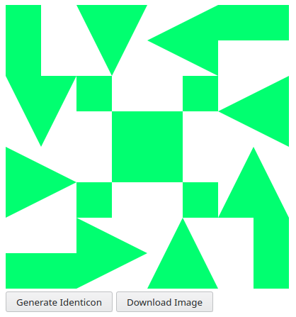
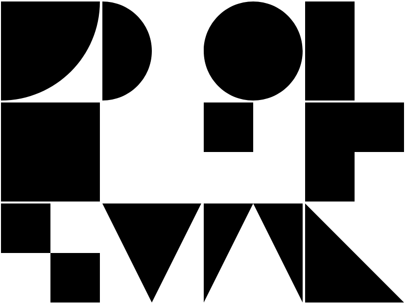
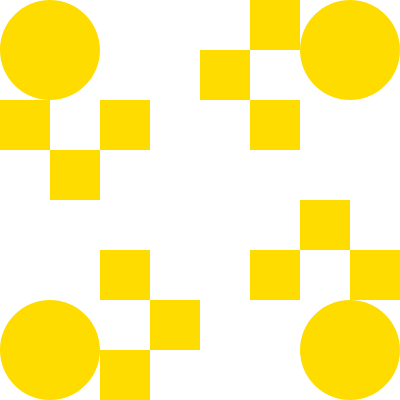

# SVG Identicon Generator

This proyect contains code to generate an [Identicon](https://en.wikipedia.org/wiki/Identicon) using SVG and JavaScript.

## How to use it

Open the [index.html](index.html) file with your browser.
There will be a button to generate a different Identicon and a button to download the current Identicon as image in PNG format.

## How it works

First, I prepared some shapes using SVG that I wanted to use as part of the Identicon.
You can see them by opening the [shapes.html](shapes.html) file in your browser.

Then, four random shapes are selected to represent the upper left quarter of the Identicon. That same group of shapes is rotated 90, 180 and 270 degree around the center of the Identicon to complete it.

Lastly, a random color from a list is applied to the Identicon.

These are some examples of it.

## Inspiration

The original idea came from the Android App [Identiconizer!](https://f-droid.org/packages/com.germainz.identiconizer/) that I used to generate icons for my contacts.

The [Practical Procedural Generation for Everyone](https://www.youtube.com/watch?v=WumyfLEa6bU) talk from [Kate Compton](https://www.galaxykate.com/) also inspired me to make a simple Identicon generator.
